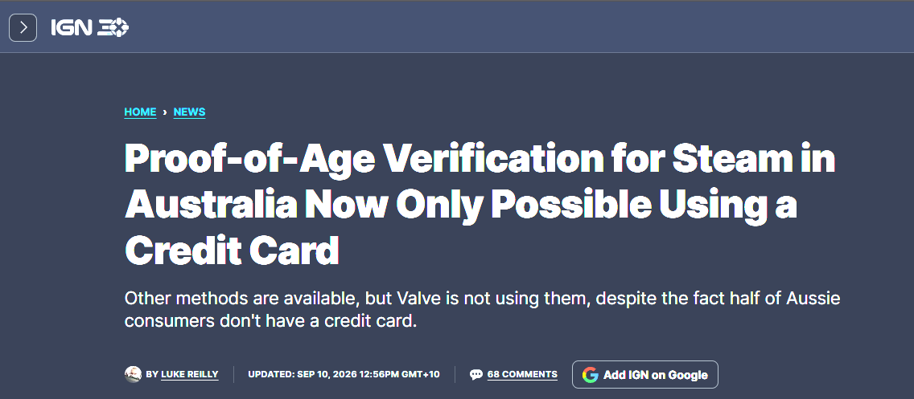
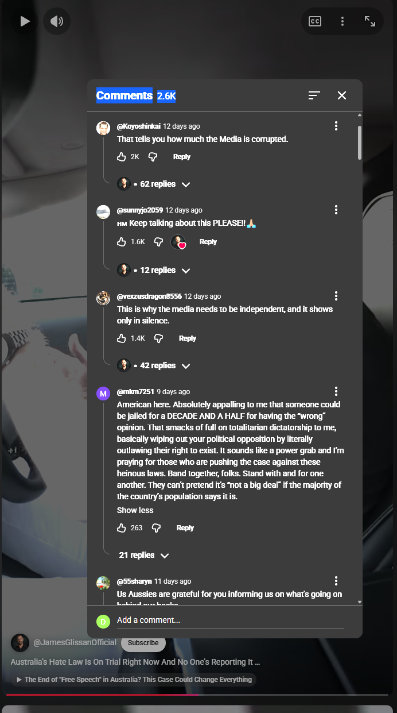
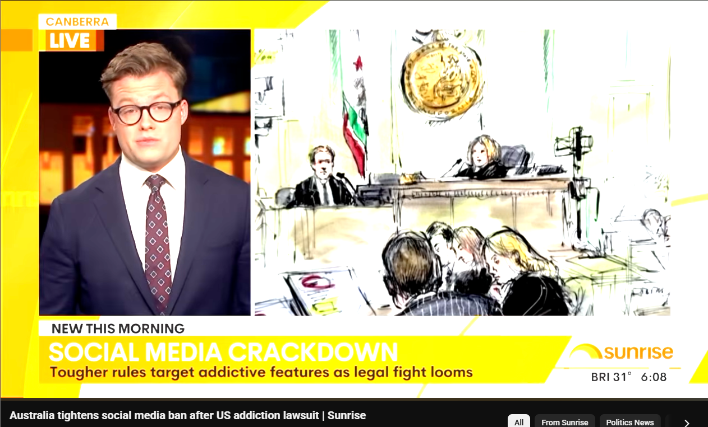
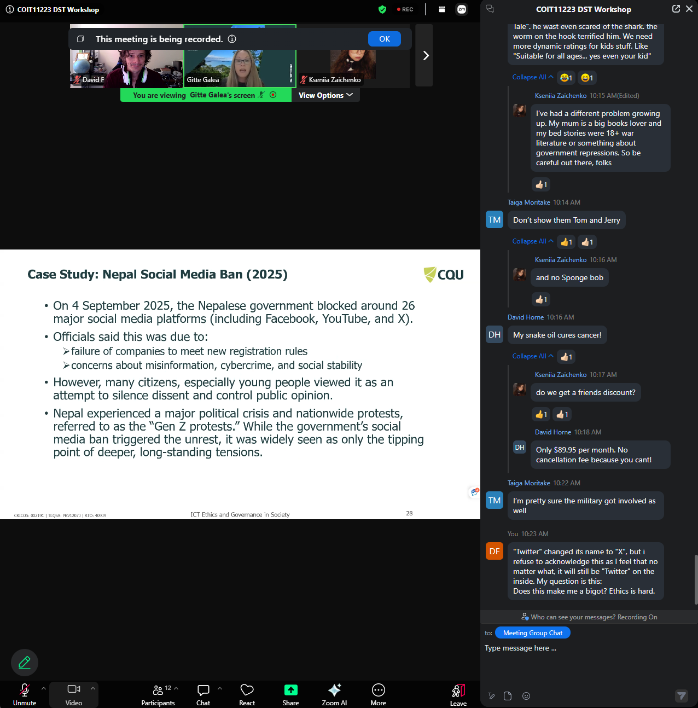

# Week-9-e-portfolio
A collection of Artefacts and reflections on my understanding of Censorship
## Artefact 1:
 

### Summary of the Artefact
A report from IGN that outlines the details of the recent Steam age verification laws in Australia.

### Justification of why I chose the artefact:
This report covers an interesting case of age restrictions being implemented on the video game marketplace “Steam”. It is true that video games have had age ratings for some time, and age verification is already necessary for social media so in theory this shouldn’t be much different. The issue has stemmed from the method of verification, with Steam requiring a credit card as the only option for verification. This can be interpreted as a form of censorship, as not every adult can obtain a credit card. Circumstances like a bad credit score or a lack of home address could remove a legitimate customers access to content, and to me this seems like an almost incidental case of censorship. To me this is a cautionary tale, of how poor accessibility to a system can unfairly restrict users, and that some forms of censorship may be a consequence instead of a goal.

## Artefact 2:
 
### Summary of the Artefact
A video outlining some details on the ongoing court case of White Australia Party V Commonewealth
### Justification of why I chose the artefact:
This video covers a content creators outlook on the Combatting Antisemitism, Hate and Extremism (Criminal and Migration Laws) Act 2026 that was passed in January of this year. This source stands out to me because of how politically charged the situation is. The creator makes claims about the implied freedom of political communication, and very notably does not comment on the notion of free speech. In a vacuum the idea of someone's political opinions being deemed illegal goes against what I believe to be ethical. However the party that is at the forefront of this case is a white nationalist group, which seems to me to use the idea of political freedom of expression to shield themselves from reasonable criticism and consequences. Laws theoretically exist to protect order, to dissuade antisocial behaviours amongst the populace and to enforce consequences on those that break them. If you are legally protected while doing unethical and antagonistic behaviour, you risk the consequences of that behaviour escalating to illegal methods from those you have harmed.

## Artefact 3:
 
### Summary of the Artefact
A Youtube video from Sunrise in response to a landmark ruling in America.
### Justification of why I chose the artefact:
While this video was short it brought to mind a few arguments that feel relevant to censorship. The report follows a ruling that found Meta and Google sued for 4 million dollars due to the addictive nature of the content, and the adverse mental affects that it has had. Is it truly censorship to limit or remove access to content that is proven to be harmful to consumers? In this case I would argue that there is a responsibility of developers to censor YOURSELF if there is a risk of doing harm.
## Artefact 4:
 
## Description:
A reflection on this weeks workshop and our discussions within it.

### Justification of why I chose the artefact:
This week we discussed at length censorship within Australia and the roles of the government in implementing it. While there were many interesting discussions, what stood out to me most was the division of opinion over the Social Media Ban that happened earlier this year. There were those in favour of the ban, stating a usage of social media being unhealthy or unsafe. Others were opposed, arguing a right to communication, and an ability to learn to self regulate. Both sides of these arguments have merit, and are based in emotion along with facts. Censorship in any form will likely receive similar scrutiny amongst those affected, and any action that is made towards such a thing needs to be well researched and presented.

## References:
https://www.ign.com/articles/proof-of-age-verification-for-steam-in-australia-now-only-possible-using-a-credit-card

[https://www.esafety.gov.au/about-us/industry-regulation/social-media-age-restrictions](https://www.youtube.com/watch?v=78m6mxVKWs0)

https://www.youtube.com/shorts/67iDOU605yw

